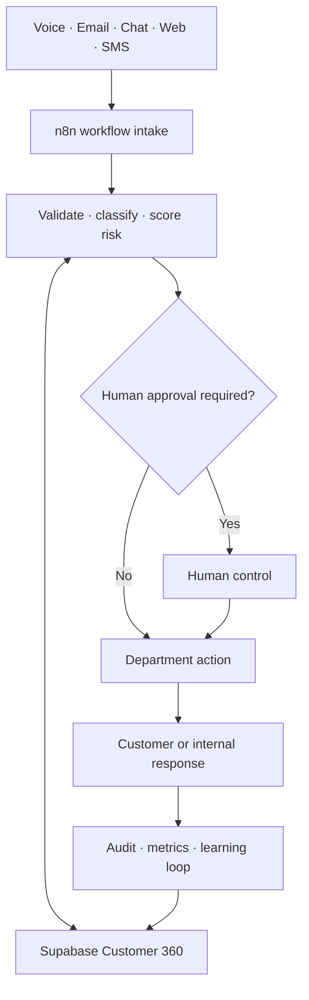

# OmniServe AI

An open, importable n8n + Supabase operating system for customer support, sales, service delivery, finance, analytics, and governance.

> **Implementation status:** 100/100 workflow definitions are built. Workflow 001 has been runtime-tested by the project owner; workflows 002-100 require credential attachment and runtime validation in the target n8n instance before production activation.

## Coverage

| Department | Workflows | Files |
|---|---:|---:|
| Customer Operations | 25 | 25 |
| Sales & Growth | 20 | 20 |
| Service Delivery | 20 | 20 |
| Finance & Administration | 15 | 15 |
| Data & Intelligence | 10 | 10 |
| QA, Risk & Governance | 10 | 10 |
| **Total** | **100** | **100** |

## Operating flow



Every generated workflow includes a webhook, input normalization, risk/confidence policy, Supabase persistence, three-attempt retry behavior, audit context, and a structured response. High-risk operations create a pending approval request.

## Quick start

1. Run the SQL files in `supabase/` in numeric order.
2. In n8n, create a **Header Auth** credential named `OmniServe Supabase Service Role`.
3. Set header name to `apikey` and value to your Supabase secret/service-role key.
4. Import workflows with `powershell -ExecutionPolicy Bypass -File scripts/import-all.ps1`.
5. Attach the Supabase credential to each `Persist Event and Audit` HTTP Request node.
6. Keep workflows inactive until their test execution succeeds.
7. Run `scripts/smoke-test.ps1` while each selected workflow is listening for a test event.

Never commit API keys. `.env.example` contains names only.

## Repository map

```text
n8n-workflows/
  customer-operations/     25 workflows
  sales-growth/            20 workflows
  service-delivery/        20 workflows
  finance-admin/           15 workflows
  data-intelligence/       10 workflows
  qa-risk-governance/      10 workflows
supabase/                  schema, Customer 360, RPCs, approvals, audit
manifest/workflows.json    machine-readable catalog of all 100 workflows
scripts/                   validation, import, and smoke testing
docs/                      architecture, credentials, deployment, catalog
```

## Validation

```bash
node scripts/validate-workflows.mjs
```

The GitHub Actions workflow runs this check on every push and pull request.

## Production boundary

The repository is code-complete, not automatically production-approved. Production readiness additionally requires successful executions in the destination n8n instance, valid credentials, channel-specific integrations, alerting, backups, security review, and approval thresholds chosen for the actual company.

See the [purpose and use of all 100 workflows](docs/workflow-purpose-guide.md), [workflow catalog](docs/workflow-catalog.md), [architecture](docs/architecture.md), [credential map](docs/credential-map.md), and [deployment checklist](docs/deployment.md).
