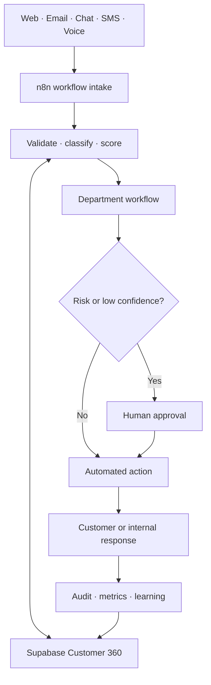

<div align="center">

# OmniServe AI

### A 100-workflow AI automation operating system for a connected company

Customer support, sales, service delivery, finance, analytics, and governance coordinated through **n8n**, **Supabase**, and **human-controlled AI automation**.

[](https://github.com/alejandrolim07-droid/omniserve-ai/actions/workflows/validate.yml)


[Explore the workflows](docs/workflow-catalog.md) · [Read the case study](docs/project-case-study.md) · [View all examples](docs/workflow-example-index.md) · [Deployment guide](docs/deployment.md)

</div>

---

## Overview

OmniServe AI is a portfolio-scale automation architecture designed to operate like the shared nervous system of a company. Instead of keeping customer support, sales, billing, service delivery, and reporting in disconnected tools, OmniServe sends every important interaction through a common workflow contract and shared Customer 360.

The project demonstrates how I design automation systems that combine:

- AI-assisted understanding and drafting;
- deterministic business rules;
- shared operational data;
- human approval for sensitive decisions;
- traceable events and audit history;
- reusable APIs, webhooks, and workflow patterns.

> [!IMPORTANT]
> **Implementation status:** all 100 n8n workflow definitions are built and pass automated structural validation. Workflow 001 has owner-confirmed runtime testing. Workflows 002-100 still require credentials and execution evidence in the destination n8n environment before production activation.

## The problem it solves

Companies often lose customer context between departments. A lead may exist in one CRM, a support complaint in another system, and an invoice in a spreadsheet. This creates duplicate data, missed follow-ups, slow handoffs, inconsistent decisions, and weak accountability.

OmniServe provides one connected operating model:

1. Receive the customer or internal event.
2. Validate and understand the request.
3. Read or update the shared Customer 360.
4. Route work to the correct department.
5. Apply confidence, risk, and approval policies.
6. Execute the approved action.
7. Respond, audit, measure, and improve.

## At a glance

| Capability | Implementation |
|---|---|
| Workflow orchestration | n8n webhook, Code, HTTP Request, and response nodes |
| Shared system of record | Supabase/PostgreSQL Customer 360 |
| AI assistance | Intent, priority, sentiment, drafting, forecasting, and reporting patterns |
| Human control | Approval requests for financial, privacy, access, fraud, and security operations |
| Reliability | Idempotent correlation IDs, retry handling, validation, and structured responses |
| Governance | RLS-enabled tables, service-role RPCs, consent, PII, audit, and retention workflows |
| Developer experience | Import scripts, smoke tests, example payloads, manifest, and GitHub Actions |

## Workflow coverage

| Department | Workflows | Responsibilities |
|---|---:|---|
| Customer Operations | 25 | Intake, identity, cases, routing, responses, escalation, satisfaction |
| Sales and Growth | 20 | Leads, scoring, sequences, meetings, proposals, pipeline, forecasting |
| Service Delivery | 20 | Onboarding, work orders, scheduling, delivery, incidents, renewals |
| Finance and Administration | 15 | Invoices, payments, refunds, expenses, contracts, financial summaries |
| Data and Intelligence | 10 | Customer 360, data quality, KPIs, forecasting, segmentation, reports |
| QA, Risk, and Governance | 10 | Confidence gates, approvals, privacy, access, audit, compliance, security |
| **Total** | **100** | **One connected company operating model** |

## System architecture



Every generated workflow contains:

1. a webhook trigger;
2. input normalization and policy evaluation;
3. Supabase event and audit persistence;
4. retry handling for database requests;
5. human-approval routing when required;
6. a structured JSON response.

## Example business journey

Consider a customer who reports being charged twice:

```mermaid
flowchart LR
  Message["Billing complaint"] --> Match["Identity matching"]
  Match --> Classify["Intent and priority"]
  Classify --> Case["Create billing case"]
  Case --> Refund["Refund request"]
  Refund --> Approve["Human approval"]
  Approve --> Reconcile["Payment reconciliation"]
  Reconcile --> Notify["Customer update"]
  Notify --> Learn["CSAT and reporting"]
```



The customer receives a traceable case. The refund is paused for an authorized person when the amount or risk exceeds policy. Every decision is recorded in the audit log, and the final outcome updates reporting.

See [examples for all 100 workflows](docs/workflow-example-index.md) for realistic triggers and expected outcomes.

## Safety and engineering controls

- **Human-in-the-loop:** high-risk workflows create pending approval requests.
- **Confidence gate:** confidence below `0.70` requires human review.
- **Financial threshold:** amounts of `1,000` or more require approval by default.
- **Idempotency:** `workflow_key + correlation_id` prevents duplicate event creation.
- **Retries:** Supabase persistence retries up to three times.
- **Auditability:** important actions record actor, resource, decision, and timestamp.
- **Least exposure:** real credentials stay in n8n and never appear in workflow JSON.
- **Database security:** operational tables use row-level security and restricted RPC execution.

## Repository structure

```text
omniserve-ai/
├── n8n-workflows/
│   ├── customer-operations/     # 25 workflows
│   ├── sales-growth/            # 20 workflows
│   ├── service-delivery/        # 20 workflows
│   ├── finance-admin/           # 15 workflows
│   ├── data-intelligence/       # 10 workflows
│   └── qa-risk-governance/      # 10 workflows
├── supabase/                    # Customer 360, operational schema, RPCs
├── examples/                    # Fictional request payloads and usage guide
├── manifest/workflows.json      # Machine-readable 100-workflow catalog
├── scripts/                     # Import, validation, and smoke-test utilities
├── docs/                        # Architecture, examples, case study, deployment
└── .github/workflows/           # Continuous validation
```

## Documentation

| Document | What it contains |
|---|---|
| [Project case study](docs/project-case-study.md) | Business problem, my role, architecture, decisions, challenges, testing, and status |
| [Workflow catalog](docs/workflow-catalog.md) | All 100 workflow files grouped by department |
| [Workflow purpose guide](docs/workflow-purpose-guide.md) | Purpose and practical use of every workflow |
| [100 workflow examples](docs/workflow-example-index.md) | One realistic trigger and outcome for every workflow |
| [Architecture](docs/architecture.md) | Operating flow, event contract, and safety model |
| [Example payloads](examples/README.md) | Ready-to-use fictional JSON and PowerShell instructions |
| [Credential map](docs/credential-map.md) | Required and optional n8n credentials without secret values |
| [Deployment checklist](docs/deployment.md) | Database, n8n, security, and evidence requirements |

## Quick start

### Prerequisites

- Node.js and npm
- n8n 2.x
- a Supabase project
- PowerShell on Windows, or an equivalent terminal

### 1. Clone the repository

```powershell
git clone https://github.com/alejandrolim07-droid/omniserve-ai.git
cd omniserve-ai
```

### 2. Prepare Supabase

Run the files inside `supabase/` in numeric order:

```text
001_customer_360_schema.sql
002_create_customer_case_function.sql
003_customer_identity_and_profile.sql
004_omniserve_operations_platform.sql
```

The migrations are designed to be rerunnable where applicable, so existing base tables do not need to be deleted.

### 3. Create the n8n credential

Create a **Header Auth** credential:

| Setting | Value |
|---|---|
| Credential name | `OmniServe Supabase Service Role` |
| Header name | `apikey` |
| Header value | Your Supabase secret/service-role key |

Do not commit the key or paste it into workflow JSON.

### 4. Import the workflows

```powershell
powershell -ExecutionPolicy Bypass -File .\scripts\import-all.ps1
```

Attach the Supabase credential to the `Persist Event and Audit` node before testing or activation.

### 5. Test a workflow

Open the selected workflow in n8n and click **Listen for test event**. Then run:

```powershell
$body = Get-Content ".\examples\customer-operations.json" -Raw

Invoke-RestMethod `
  -Uri "http://localhost:5678/webhook-test/omniserve-case-creation" `
  -Method POST `
  -ContentType "application/json" `
  -Body $body
```

Verify the n8n execution and corresponding rows in `automation_events`, `audit_log`, and, when applicable, `approval_requests`.

## Validation

Validate the complete workflow set locally:

```bash
node scripts/validate-workflows.mjs
```

The validator confirms that:

- the manifest contains exactly 100 workflows;
- every referenced JSON file exists;
- every workflow has a valid n8n structure;
- node connections reference real nodes.

GitHub Actions runs the same validation after every push and pull request.

## Technology

`n8n` · `Supabase` · `PostgreSQL` · `PL/pgSQL` · `JavaScript` · `REST APIs` · `Webhooks` · `OpenAI API` · `PowerShell` · `GitHub Actions`

## Implementation status

| Area | Status |
|---|---|
| 100 workflow JSON definitions | ✅ Built |
| Workflow manifest and structural validation | ✅ Passing |
| Supabase schema, RPCs, approvals, and audit | ✅ Built |
| Example payloads and technical documentation | ✅ Built |
| Workflow 001 local n8n/Supabase execution | ✅ Owner-confirmed |
| Workflows 002-100 live execution evidence | 🟠 Required |
| Gmail, Twilio, Slack, Notion, Stripe, and CRM credentials | 🟠 Deployment-specific |
| Production security, backups, monitoring, and policy review | 🟠 Deployment-specific |

## Production boundary

This repository is implementation-complete at the workflow-definition level, but it is not presented as an automatically production-approved company system. Production readiness requires real provider credentials, successful execution evidence, monitoring, backups, security review, organization-specific approval owners, and legal/privacy decisions for communication recording, PII, consent, and retention.

## Author

Designed and implemented as an AI automation portfolio project by [Alejandro Lim](https://github.com/alejandrolim07-droid).

## License

Released under the [MIT License](LICENSE).
