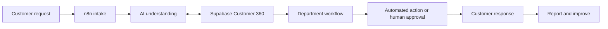

# OmniServe AI

AI-powered company operations and Customer 360 automation built with n8n, Supabase and OpenAI.

> **Current status:** foundation in progress. The first customer-intake workflow is implemented; the remaining workflows are documented in the 100-workflow roadmap.

## What OmniServe does

OmniServe connects customer operations, sales, service delivery, finance, data intelligence and governance through one shared Customer 360.



## Implemented workflow

### Customer intake and case routing

`n8n-workflows/customer-operations/01-customer-intake.json`

The workflow:

1. Receives a customer request through an n8n webhook.
2. Validates the name, email and message.
3. Routes the case to Sales, Customer Support or Billing.
4. Assigns Normal, High or Critical priority.
5. Creates a case number.
6. Saves the customer, case and audit event in Supabase.
7. Returns a structured response.

## Repository structure

```text
omniserve-ai/
├── docs/
│   ├── architecture.md
│   └── workflow-catalog.md
├── n8n-workflows/
│   └── customer-operations/
│       └── 01-customer-intake.json
├── supabase/
│   ├── 001_customer_360_schema.sql
│   └── 002_create_customer_case_function.sql
├── .env.example
└── README.md
```

## Import the workflow into n8n

1. Download the workflow JSON.
2. In n8n, choose **Import from File**.
3. Open **Save Case to Supabase**.
4. Select a Header Auth credential containing your Supabase service-role key.
5. Run both SQL files in the Supabase SQL Editor.
6. Test with the n8n test webhook before activation.

## Test with PowerShell

```powershell
$body = @{
  name = "Alejandro"
  email = "test@example.com"
  message = "My invoice has an incorrect charge and I need help"
} | ConvertTo-Json

Invoke-RestMethod `
  -Uri "http://localhost:5678/webhook-test/omniserve-customer-intake" `
  -Method POST `
  -ContentType "application/json" `
  -Body $body
```

## Planned coverage

- Customer Operations: 25 workflows
- Sales and Growth: 20 workflows
- Service Delivery: 20 workflows
- Finance and Administration: 15 workflows
- Data and Intelligence: 10 workflows
- QA, Risk and Governance: 10 workflows

See the [complete 100-workflow catalog](docs/workflow-catalog.md) and [architecture](docs/architecture.md).

## Security

- No API keys or credentials are committed.
- Keep Supabase service-role credentials inside n8n.
- Use human approval for financial, security and high-risk actions.
- Log important system actions to the shared audit trail.

## Technology

n8n · Supabase · PostgreSQL · OpenAI API · Notion · Gmail · Twilio · Slack
