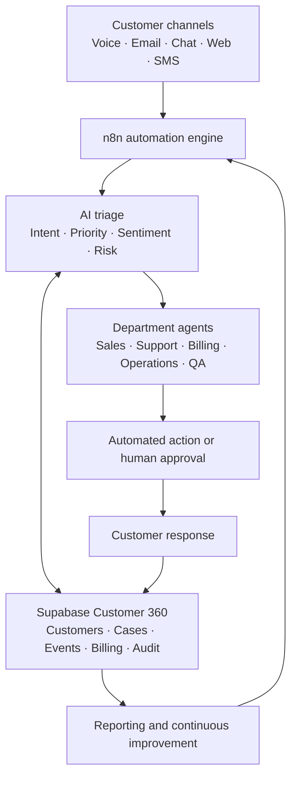

# OmniServe AI Architecture

## Design principles

- One shared Customer 360 is the source of truth.
- Each workflow is independently importable and testable.
- Credentials stay in n8n and are never committed to GitHub.
- High-risk, low-confidence and financial actions can require human approval.
- Every important action produces an auditable event.
- Reusable sub-workflows handle authentication, logging, errors and notifications.

## Connected stack

- n8n for orchestration
- Supabase/PostgreSQL for operational data
- OpenAI API for classification, drafting and analysis
- Notion for internal knowledge and operating procedures
- Gmail and Twilio for communication
- Slack for team notifications and approvals
- Payment providers for billing actions
- Analytics tools for dashboards and reporting
