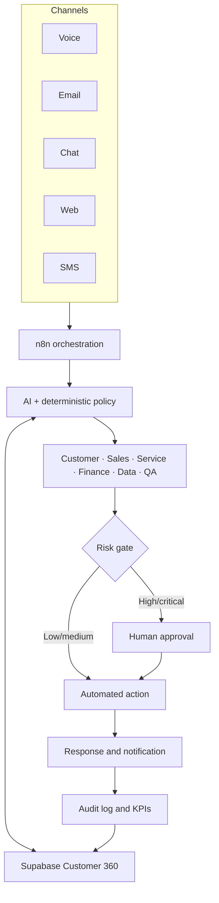

# Architecture

OmniServe uses n8n for orchestration and Supabase/PostgreSQL as the shared system of record. Each automation follows the same contract so departments remain connected instead of becoming isolated apps.

## Shared workflow contract

Each workflow accepts a JSON object and derives:

- `correlationId` for idempotency and tracing
- `subjectType` and `subjectId` for Customer 360 linking
- `confidence` from 0 to 1
- risk and human-approval status
- the original input and structured result

`process_automation_event` atomically stores the event, creates an approval request when needed, and writes an audit record. Duplicate calls with the same workflow key and correlation ID update the existing event.

## Safety defaults

- High-risk operations wait for human approval.
- Any amount of 1,000 or more waits for approval.
- Any confidence below 0.70 waits for approval.
- HTTP persistence retries three times.
- All shared tables use row-level security.
- RPC functions are executable only by `service_role`.
- Secrets stay in n8n credentials, never workflow JSON.
