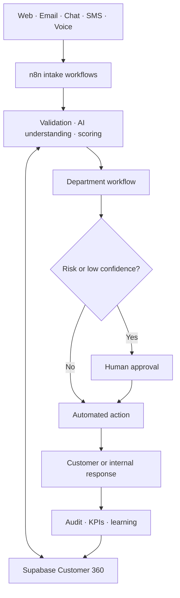

# OmniServe AI Project Case Study

## Project summary

OmniServe AI is a portfolio-scale company automation system designed to connect customer support, sales, service delivery, finance, analytics, and governance through one shared Customer 360. It uses n8n for orchestration, Supabase/PostgreSQL for operational data, and OpenAI-compatible AI steps for understanding and drafting.

The repository demonstrates how I approach a large automation project as a connected operating system rather than a collection of unrelated workflows.

## The business problem

Many companies use separate applications for leads, support tickets, billing, service delivery, and reporting. Customer information becomes duplicated, departments lose context during handoffs, follow-ups are missed, and risky actions may happen without proper review.

OmniServe addresses this by giving every workflow a shared event contract, Customer 360 database, approval system, and audit trail.

## My role

I worked on the project as an AI Automation Developer and Solution Designer. My work included:

- defining the six-department operating model;
- designing the 100-workflow catalog;
- creating importable n8n workflow definitions;
- designing the Supabase Customer 360 and operational schema;
- connecting workflows to secure Supabase RPC functions;
- adding confidence, risk, approval, retry, and audit controls;
- writing PowerShell import and test utilities for a Windows environment;
- documenting credentials without exposing secrets;
- adding automated GitHub validation and portfolio documentation.

## Scope

| Department | Workflow count | Main responsibility |
|---|---:|---|
| Customer Operations | 25 | Intake, support cases, responses, escalation, satisfaction |
| Sales and Growth | 20 | Leads, qualification, meetings, proposals, pipeline, forecasting |
| Service Delivery | 20 | Onboarding, work orders, scheduling, delivery, maintenance |
| Finance and Administration | 15 | Invoices, payments, refunds, expenses, contracts, reporting |
| Data and Intelligence | 10 | Customer 360, KPIs, segmentation, forecasting, executive reporting |
| QA, Risk, and Governance | 10 | Confidence gates, approvals, privacy, access, audit, compliance |
| **Total** | **100** | **Connected company operations** |

## Architecture



## Standard workflow design

Workflows 007-100 share a predictable four-node design:

1. **Workflow Webhook** receives a JSON request.
2. **Validate and Apply Policy** normalizes identifiers, applies risk rules, checks confidence, and decides whether human approval is required.
3. **Persist Event and Audit** calls the secure `process_automation_event` Supabase function with retry handling.
4. **Return Workflow Result** gives the calling system a structured JSON response.

This repeated contract makes the system easier to maintain and allows one department to call another without creating a different integration format for every workflow.

## Shared event contract

```json
{
  "correlationId": "DEMO-2026-0001",
  "subjectType": "customer",
  "subjectId": "customer-001",
  "confidence": 0.94,
  "amount": 250,
  "message": "The business information needed by the selected workflow"
}
```

- `correlationId` makes requests traceable and idempotent.
- `subjectType` identifies whether the request concerns a customer, lead, case, invoice, or service order.
- `subjectId` links related events.
- `confidence` controls whether uncertain AI output can execute.
- `amount` triggers approval when a financial threshold is reached.
- Additional fields remain available inside the stored `input` object.

## Data model

The database includes:

- customers and support cases;
- case events and interaction history;
- leads and sales information;
- service requests and work orders;
- invoices and financial metadata;
- knowledge articles;
- automation events;
- human approval requests;
- immutable-style audit entries.

The `process_automation_event` RPC writes the workflow event, creates a pending approval when necessary, and records an audit entry in one database transaction.

## Safety and governance decisions

- High-risk operations require human approval by default.
- Requests involving an amount of 1,000 or more require approval.
- AI confidence below 0.70 requires approval.
- Database requests retry up to three times.
- Shared tables have row-level security enabled.
- RPC execution is restricted to the Supabase service role.
- API credentials are stored in n8n, not committed to GitHub.
- Duplicate workflow calls use the workflow key and correlation ID for idempotency.

## Example end-to-end customer journey

1. A customer submits a billing complaint through a web form.
2. Omnichannel Intake standardizes the request.
3. Identity Matching finds the Customer 360 record.
4. Intent Classification identifies billing and refund intent.
5. Priority Scoring and Sentiment Detection detect urgency and frustration.
6. Case Creation creates a traceable case.
7. Department Routing sends it to Billing.
8. Refund Request Processing validates the transaction and evidence.
9. Refund Approval Routing pauses the action for an authorized human.
10. Payment Reconciliation checks the transaction after approval.
11. Status Notification informs the customer.
12. Satisfaction Survey records feedback.
13. Central Event Collection and KPI Dashboard Updates capture performance.
14. Complete Audit Logging preserves the full decision history.

## Testing and evidence

- All 100 workflow files pass automated structural validation.
- GitHub Actions runs validation on every push and pull request.
- Workflow 001 has an owner-confirmed local n8n and Supabase execution.
- Workflows 002-100 are implemented and structurally validated but still require credential attachment and runtime evidence in the destination n8n instance.
- The repository includes PowerShell import and smoke-test scripts.

This distinction is intentional: the repository does not claim that workflows are production-tested when they have only passed static validation.

## Challenges and solutions

### Keeping 100 workflows consistent

I used a standard event contract and shared node layout. This reduces configuration drift and gives every workflow the same tracing, risk, persistence, and response behavior.

### Preventing dangerous automatic actions

Financial, privacy, fraud, access-control, and security operations are treated as high risk. They create approval requests instead of silently completing.

### Avoiding duplicate events

The database uses a unique combination of workflow key and correlation ID. Retried requests update the existing event instead of producing multiple actions.

### Protecting credentials

Workflow JSON contains credential placeholders only. The real service-role and provider secrets belong in n8n credentials and are excluded from GitHub.

### Making the project understandable to non-technical reviewers

The repository includes architecture diagrams, a complete catalog, a purpose guide, example scenarios, payloads, deployment instructions, and transparent implementation status.

## Technology used

- n8n 2.x
- Supabase and PostgreSQL
- SQL and PL/pgSQL RPC functions
- JavaScript inside n8n Code nodes
- REST APIs and webhooks
- OpenAI-compatible API calls
- PowerShell testing utilities
- GitHub and GitHub Actions

## Current status

The repository is implementation-complete at the workflow-definition level. It is ready for staged deployment and runtime testing. It is not represented as a fully deployed production company because provider credentials, real communication accounts, approval owners, production policies, and complete execution evidence depend on the target organization.

## What this project demonstrates

- enterprise-style workflow decomposition;
- API and webhook integration design;
- relational data modeling;
- AI-assisted routing and decision support;
- human-in-the-loop automation;
- auditability and idempotency;
- secure credential boundaries;
- technical documentation and honest delivery status.

## Short portfolio description

> Designed and implemented OmniServe AI, a 100-workflow n8n and Supabase automation architecture connecting customer support, sales, service delivery, finance, analytics, and governance. Built shared Customer 360 storage, secure RPC functions, human approval controls, audit logging, retry handling, validation scripts, and complete technical documentation. All workflow definitions pass automated GitHub validation; live production rollout remains credential- and environment-dependent.

